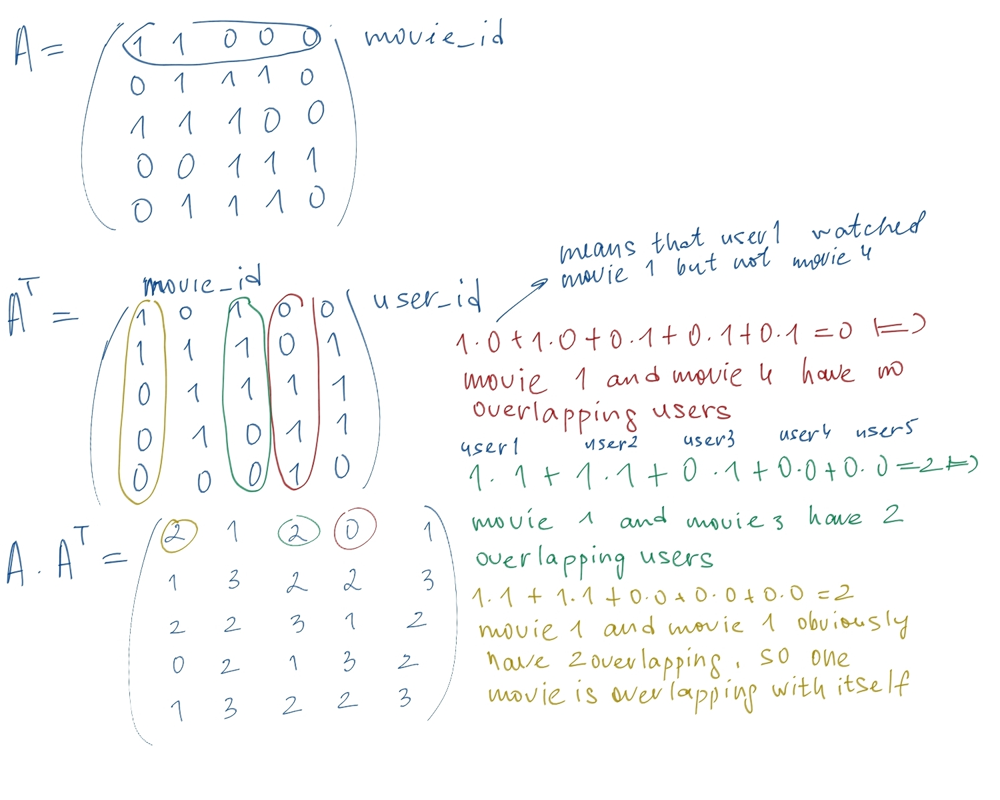

We have matrix like this:

Rows is movie and columns is users ratings of this movie. Transpose matrix is where users is rows and columns as all movies they
rated. So when we multiplying original matrix with another we get that movie from original matrix (row) multiplies with another
movie from transpose matrix (column) and because they have only ones and zeros we've got matrix where user saw both movies values 
is bigger and when user watched one film but not another, these values getting lower.

