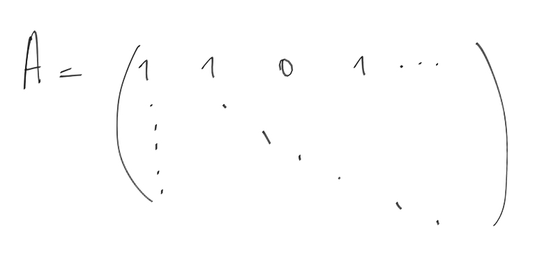

We have matrix like this:

Rows are movies and columns are users ratings of this movie. Transpose matrix is where users are rows and columns are all movies they
rated. So when we are multiplying original matrix with another we get that movie from original matrix (row) multiplies with another
movie from transpose matrix (column) and because they have only ones and zeros we've got matrix where user saw both movies values 
is bigger and when user watched one film but not another, these values getting lower.

